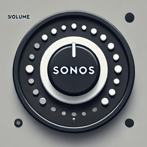

# Sonos Volume Dial

A Stream Deck+ plugin that lets you control your Sonos speaker's volume using the Stream Deck+ dial. Seamlessly adjust volume, mute/unmute, and get real-time feedback directly on your Stream Deck+.



## Demo


## Features

- Control Sonos speaker volume using the Stream Deck+ dial
- Mute/unmute by pressing the dial or tapping the touch screen
- Configure volume step size (1%, 2%, 5%, or 10%)
- Real-time volume indicator on the touchscreen display
- Works with any Sonos speaker on your local network

## Requirements

- Stream Deck+
- Stream Deck software 6.4 or later
- macOS 12+ or Windows 10+
- Sonos speaker on your local network

## Installation

1. Download the latest release from the [releases page](https://github.com/moonbeamalpha/sonos-volume-dial/releases)
2. Double-click the `.streamDeckPlugin` file to install
3. Find your Sonos speaker's IP address:
   - Open the Sonos app
   - Go to Settings > General Settings > About Your System
   - Find your speaker in the list and note its IP address
4. Add the Sonos Volume Dial action to your Stream Deck+
5. Enter your speaker's IP address in the action settings
6. Optionally adjust the volume step size (default: 5%)

## Usage

- **Rotate dial**: Adjust volume up/down
- **Press dial**: Toggle mute
- **Tap screen**: Toggle mute
- Dimmed visuals indicate if speaker is muted
- Current volume level shown on dial

## Development

Requirements:

- Node.js 20 or later
- npm or yarn
- Stream Deck software

```bash
# Clone the repository
git clone https://github.com/moonbeamalpha/sonos-volume-dial.git
cd sonos-volume-dial

# Install dependencies
npm install

# Build the plugin
npm run build

# Watch for changes during development
npm run watch

# Enable developer mode
streamdeck dev

# Link the plugin to Stream Deck
streamdeck link com.moonbeamalpha.sonos-volume-dial.sdPlugin

# Make changes and reload plugin
streamdeck restart com.moonbeamalpha.sonos-volume-dial.sdPlugin
```

## License

This project is licensed under the MIT License - see the [LICENSE](LICENSE) file for details.

## Acknowledgments

- Built using the [Elgato Stream Deck SDK](https://developer.elgato.com/documentation/stream-deck/)
- Uses [sonos](https://github.com/bencevans/node-sonos) for Sonos control
- Icons adapted from SF Symbols
- Written entirely using [Cursor](https://cursor.sh/) and Claude-3.5-Sonnet
